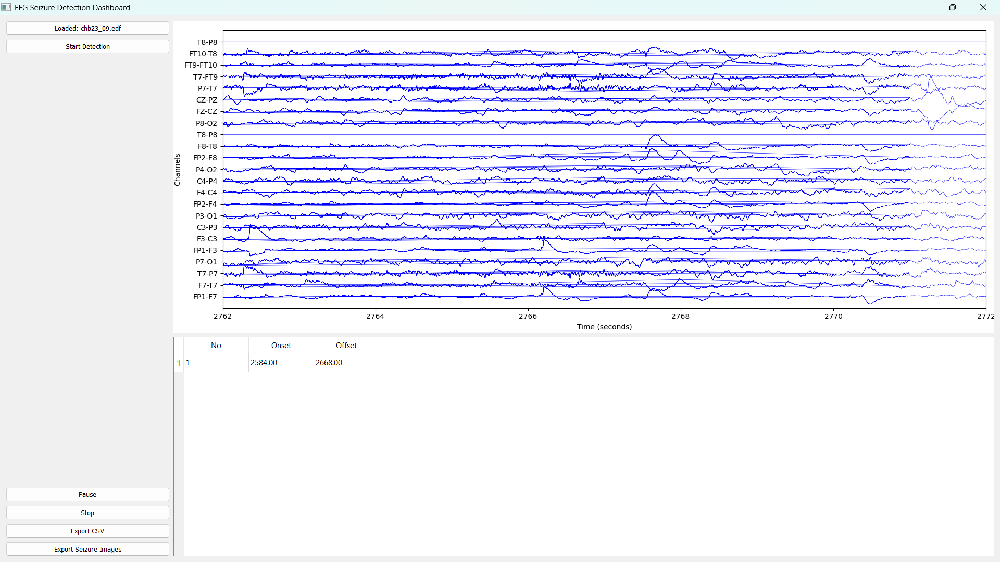
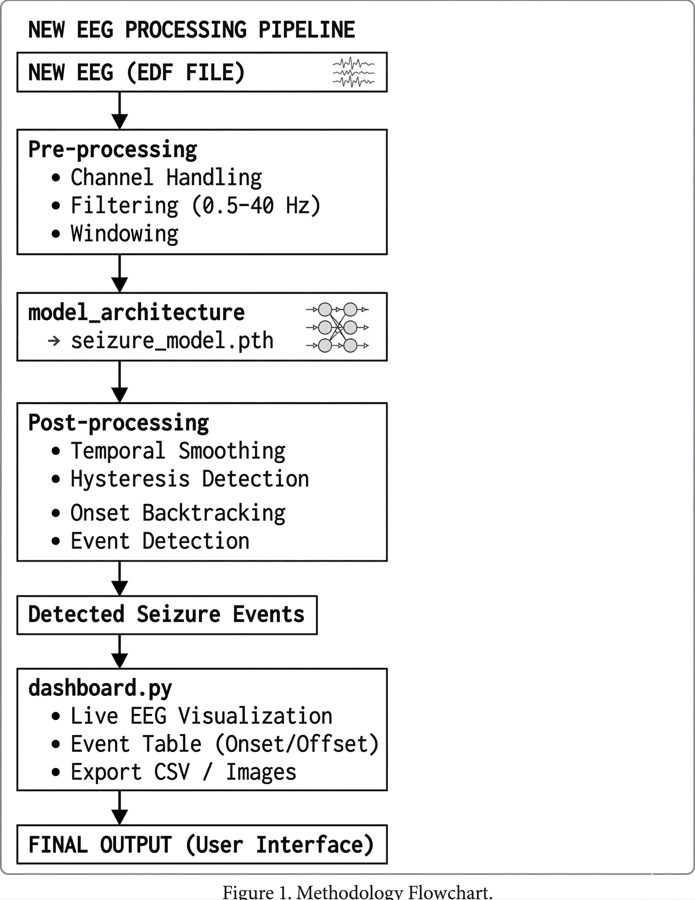

# EEG Seizure Detection System

A hybrid deep learning system for automated seizure detection using EEG signals from the CHB-MIT Scalp EEG Database.

## Overview

This project detects epileptic seizure activity from EEG recordings using a multi-stage pipeline that includes signal preprocessing, dataset preparation, deep learning classification, post-processing logic, and a graphical dashboard for visualization.

## Key Features

- EEG preprocessing with channel handling and bandpass filtering (0.5–40 Hz)
- Fixed-window EEG segmentation
- Dataset balancing for class imbalance reduction
- Hybrid deep learning model:
  - 1D CNN
  - Channel Attention
  - BiLSTM
  - Transformer Encoder
- Seizure probability prediction
- Post-processing with:
  - Temporal smoothing
  - Hysteresis thresholding
  - Onset backtracking
  - Event detection
- GUI dashboard for EEG visualization and seizure event display
- CSV export support

## Model Architecture

EEG Input  
→ CNN Feature Extraction  
→ Channel Attention  
→ BiLSTM Temporal Learning  
→ Transformer Global Context  
→ Fully Connected Classifier  
→ Seizure Probability

## Project Files

- `build_dataset_complete.py` – Dataset generation from EDF files  
- `build_balanced_dataset.py` – Dataset balancing  
- `normalize_dataset.py` – Mean/std normalization generation  
- `train_model.py` – Model training  
- `evaluate_model.py` – Model evaluation  
- `model_architecture.py` – Neural network definition  
- `detection_engine.py` – Real-time seizure detection pipeline  
- `dashboard.py` – GUI dashboard  

## Dataset

CHB-MIT Scalp EEG Database

## Technologies Used

- Python
- PyTorch
- NumPy
- Scikit-learn
- MNE
- SciPy
- Matplotlib
- PyQt5
- Pandas

## Installation

```bash
pip install -r requirements.txt


## Run application 

python dashboard.py

## Output

eeg waveform visualisation
detected seizure onset and offset times
event table
csv tables

## Notes

Dataset files are not included in this repository due to size limitations

author-- KGR

## Screenshots

### Dashboard


### Detection Output


### Architecture
